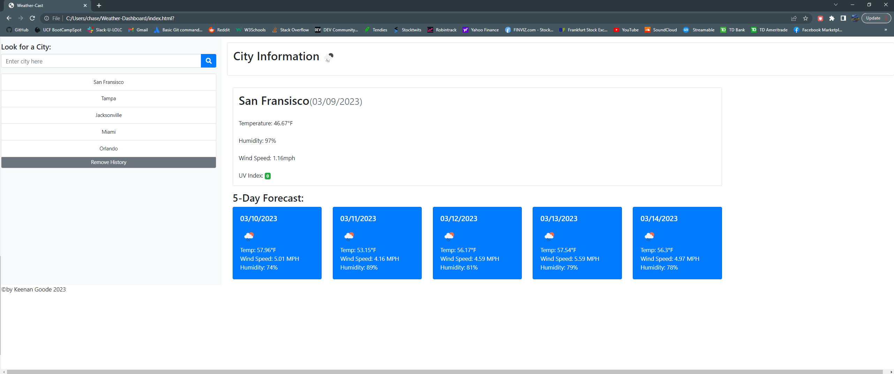

 <body>
    <h1>Weather-Dashboard: A Server-Side API Application</h1>
    
The Weather-Dashboard application demonstrates the functionality of server-side APIs to retrieve data from external servers. The application allows users to utilize the Openweather One Call API to retrieve weather data on searched cities. The retrieved data is displayed, including weather condition, wind, temperature, humidity, and UV index. The data is then stored locally for easy access.

    
The application includes functions to display a 5-day forecast and remove search history. While the application is not yet fully functional, it will be completed soon.

    <h2>Application's Utilities:</h2>
    <ul>
      <li>HTML</li>
      <li>CSS</li>
      <li>JavaScript</li>
      <li>JQuery</li>
      <li>Moment.JS</li>
      <li>Bootstrap</li>
      <li>Openweather One Call API</li>
 </ul>
 
 <h2>Screenshot of Weather-Dashboard!<h2>
  
  

    
    
    
<h2> Deployed link to Weather-Dashboard!</h2>
https://flayouth.github.io/Weather-Dashboard/
  </body>
